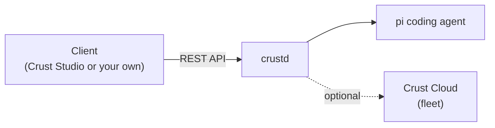

# 🥧 Crust

**A daemon and REST API that wraps the [pi coding agent](https://pi.dev) - run your coding agents locally or remotely, from any client.**

Crust is the layer around pi. It adds profiles, projects and workspaces on top of the pi coding agent and exposes them through a REST API, so you can drive your agents from your own machine, a remote server, or anywhere in between.

## Projects

| Project | Description | License |
| --- | --- | --- |
| [**crustd**](https://github.com/crusthq/crustd) | The Crust daemon. Manages profiles, projects and workspaces on top of pi and serves them over a REST API. | Apache 2.0 |
| [**crust-studio**](https://github.com/crusthq/crust-studio) | Pi Agent Studio, a client for crustd. Code with your agents locally or remotely. | Apache 2.0 |
| **Crust Cloud** *(coming soon)* | Connect multiple daemons into a fleet and distribute agents, workers and tasks across them. Hosted at [crusthq.cloud](https://crusthq.cloud), or self-host it yourself. | FSL-1.1-ALv2 |

## How it fits together

The API is the contract: Pi Agent Studio is one client, but anyone can build their own.

## Licensing

crustd and crust-studio are licensed under **Apache 2.0**. Use them, fork them, build on them, commercially or otherwise.

Crust Cloud's fleet software will be licensed under the **[Functional Source License](https://fsl.software) (FSL-1.1-ALv2)**. You can read, modify and self-host it for your own use; the only thing you can't do is offer it as a competing commercial service. Each release automatically becomes Apache 2.0 two years after it ships.

## Status

Crust is in early development. Expect rough edges and breaking changes while the API takes shape.

## Links

- 🌐 Website and docs: [crusthq.dev](https://crusthq.dev)
- ☁️ Crust Cloud: [crusthq.cloud](https://crusthq.cloud)

---

Crust is an independent project built on top of [pi](https://pi.dev) by Mario Zechner. It is not affiliated with or endorsed by the pi project.
